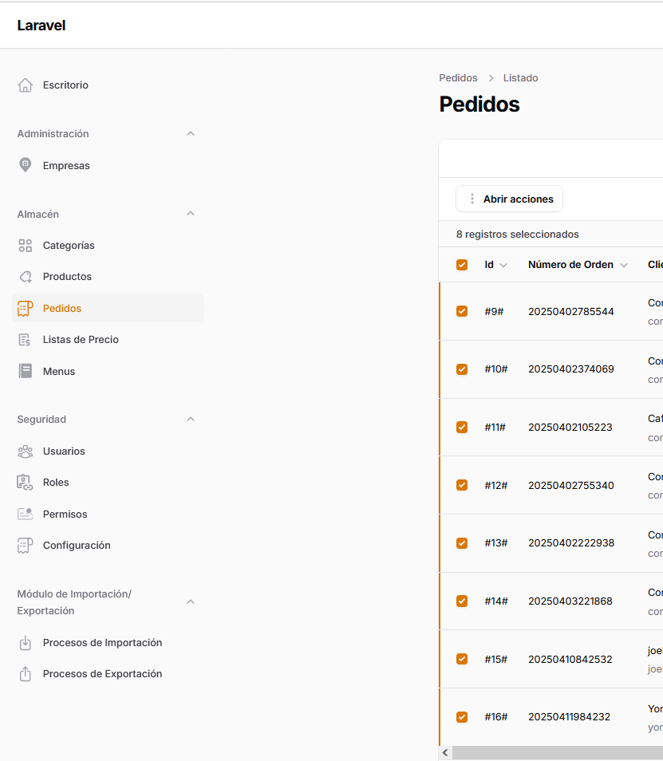

# CRM for Prepared Meal Sales Management

## General Description
DeliciusFood CRM is a comprehensive management system specifically designed to manage the sale of prepared meals ready for home delivery. This platform efficiently coordinates the operations chain from order receipt to final delivery, optimizing menu management, inventory, customers, and deliveries.

## Main Features
- Complete management of gastronomic categories and products
- Order control
- Menu administration
- Price management and customized price lists
- Security system with roles and permissions
- Data import/export module

## System Modules

### Dashboard
Main panel displaying key business metrics, including daily sales, pending orders, best-selling products, and real-time delivery status.

### Administration
#### Companies
Module for managing information about companies or branches using the system, allowing customized configurations for each business entity.

### Warehouse
#### Categories
Product organization system by gastronomic categories such as Daily Menu, Special Sandwiches, Premium Salads, Executive Dishes, light options, vegetarian options, bakery, and corporate menus. The module allows activating or deactivating categories according to availability, establishing specific subcategories (such as "Main Course" or "Salad"), creating detailed descriptions for each category, and configuring delivery rules by day of the week with maximum preparation times and deadline schedules for orders.

#### Products
Complete management of the catalog of dishes and products, including detailed information about ingredients, preparation times, nutritional values, allergens, and presentation.

#### Orders
Comprehensive control of the order lifecycle from receipt to delivery. The module allows managing orders with a unique order number, assigning customers under corporate or individual agreements, recording delivery addresses, establishing creation and delivery dates, monitoring order status (Processed, Pending, Canceled, Partially scheduled), calculating totals with and without taxes, and managing order lines with unit prices and totals for each selected product.

The module includes functionalities for:
- Creating new orders through a dedicated button
- Filtering and searching existing orders
- Selecting multiple orders for batch actions
- Exporting order lines in Excel format
- Exporting consolidated orders
- Sending emails with order information
- Visualizing the total products per order
- Managing orders by company

Additionally, the orders module offers a special "Consolidated" report that allows visualizing and analyzing orders broken down by companies, facilitating logistics planning and financial tracking by corporate client.

#### Price Lists
Flexible price management system with the ability to create multiple customized lists. It allows configuring specific lists (such as "Corporate Premium List") with minimum purchase amounts, associating companies with particular price lists, and establishing differentiated unit prices for each product according to the type of customer or agreement.

#### Menus
Creation and management of menus with classification by user type (Agreement/Café) and agreement type (Consolidated/Individual). The module allows scheduling menus by specific date, establishing maximum order dates and times, including detailed descriptions of the gastronomic offer, and organizing categories within the menu with display control and presentation order, facilitating a personalized experience for different customer segments.

### Security
#### Users
Administration of system users with personalized access according to functions and responsibilities within the organization.

#### Roles
Definition of user profiles with specific sets of permissions and capabilities within the system.

#### Permissions
Detailed configuration of actions allowed for each role, ensuring secure and appropriate access to information.

#### Configuration
General system settings including operation parameters, integrations with external services, and customization of the user experience.

### Import/Export Module
#### Import Processes
System for mass loading data to the CRM from Excel files. The module works with a queue system that allows integration with Amazon SQS or other queue processing systems, optimizing server resources and allowing background process execution. The system records each import process with exact date and time, type of imported content (users, orders), process status (processed, processed with errors), and offers the ability to download detailed error logs that facilitate debugging and problem correction during data import.

All system modules have the following import options:
- Import data (with the specific name according to the module, for example: "Import orders", "Import users", "Import categories", etc.)
- Download template (with the specific name according to the module, for example: "Download order template", "Download user template", etc.)

#### Export Processes
System for extracting data from the CRM to Excel files. The module allows generating exports by type (users, consolidated orders, order lines), shows the status of each process, allows direct download of generated files, and maintains a complete history of all exports performed for auditing and monitoring.

All system modules have specific export options accessible through the actions menu, allowing the export of:
- Data lines (with the specific name according to the module, for example: "Export order lines", "Export product lines", etc.)
- Send emails (with relevant information according to the module)

The export process history allows detailed tracking of all data extractions, facilitating auditing and control of information shared from the system.

## Technical Requirements
- PHP 8.0 or higher
- Laravel Framework
- MySQL/PostgreSQL database
- Web server compatible with PHP

## Installation and Configuration
contact: joelsuarez.1101@gmail.com

## License
contact: joelsuarez.1101@gmail.com

## Support
contact: joelsuarez.1101@gmail.com